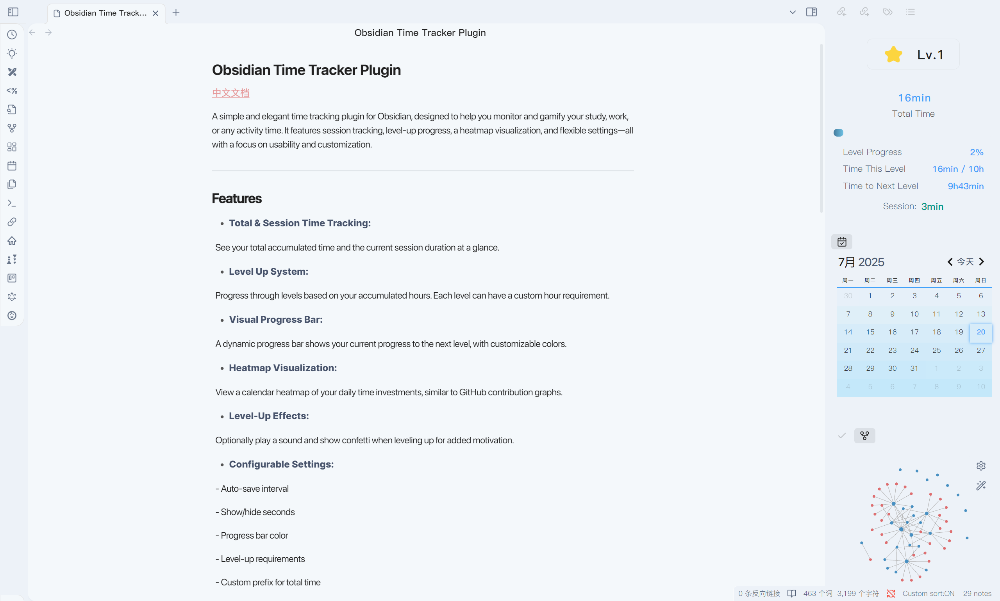
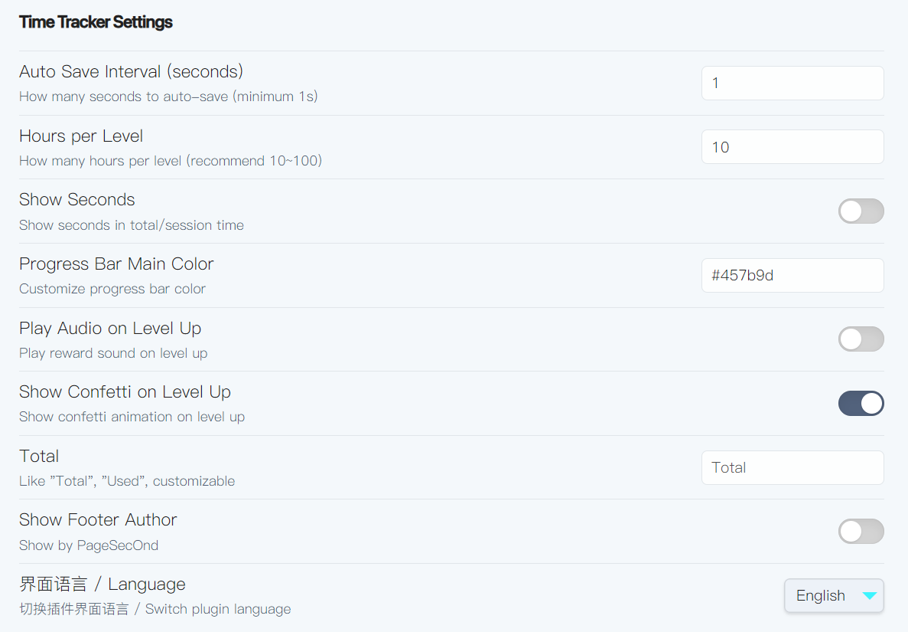

[中文](./README.zh-CN.md)

# Obsidian Time Tracker

<!-- Badges -->

  
  
  
  

> A simple and elegant time tracking plugin for Obsidian, designed to help you monitor and gamify your study, work, or any activity time. It features session tracking, level-up progress, a heatmap visualization, and flexible settings—all with a focus on usability and customization.

---

<table>
  <tr>
    <th align="center">Main</th>
    <th align="center">Settings</th>
  </tr>
  <tr>
    <td align="center"></td>
    <td align="center"></td>
  </tr>
</table>

## Features

- **Total & Session Time Tracking:**  
  See your total accumulated time and the current session duration at a glance.

- **Level Up System:**  
  Progress through levels based on your accumulated hours. Each level can have a custom hour requirement.

- **Visual Progress Bar:**  
  A dynamic progress bar shows your current progress to the next level, with customizable colors.

- **Heatmap Visualization:**  
  View a calendar heatmap of your daily time investments, similar to GitHub contribution graphs.

- **Level-Up Effects:**  
  Optionally play a sound and show confetti when leveling up for added motivation.

- **Configurable Settings:**  
  - Auto-save interval
  - Show/hide seconds
  - Progress bar color
  - Level-up requirements
  - Custom prefix for total time
  - Show/hide author footer
  - Interface language (English/简体中文)

- **Timeline Logging:**  
  Major events (level-ups) are recorded in a Markdown timeline file.

- **Bilingual Interface:**  
  All labels and settings are available in both English and Chinese, and can be switched at any time.

---

## Installation

1. Download `main.js` and place it in your Obsidian vault's plugins folder.
2. Enable "Time Tracker" in Obsidian's community plugins settings.

---

## Usage

- Click the clock icon in the sidebar to open the Time Tracker panel.
- The plugin automatically starts tracking time as soon as Obsidian is opened.
- Adjust settings via the plugin options to fit your workflow.

---

## Settings

- **Auto Save Interval:**  
  How frequently (in seconds) the plugin auto-saves your accumulated time.

- **Hours per Level:**  
  Set how many hours are required to reach each new level.

- **Show Seconds:**  
  Toggle display of seconds in time readouts.

- **Progress Bar Color:**  
  Choose your preferred color for the level progress bar.

- **Play Audio on Level Up:**  
  Enable/disable a reward sound on leveling up.

- **Show Confetti on Level Up:**  
  Enable/disable a confetti animation on leveling up.

- **Total Prefix:**  
  Customize the prefix for total time (e.g., "Total", "累计").

- **Show Footer Author:**  
  Show/hide the "by PageSecOnd" footer.

- **Language:**  
  Instantly switch between English and 简体中文.

---

## Data Storage

- Time stats are stored in `.timestats.json` in your vault root.
- Level-up events are logged in `Timeline/TimeLevel.md` as a Markdown timeline.

---

## Todo
- [ ] Support more customizable settings.
- [ ] Add more visualization effects.
- [ ] Implement heatmap display.
- [ ] Add support for more languages.
- [ ] Separate styles and language from the core program for easier future expansion.

---

## Credits

by PageSecOnd

---

## License

MIT © [PageSecOnd]
