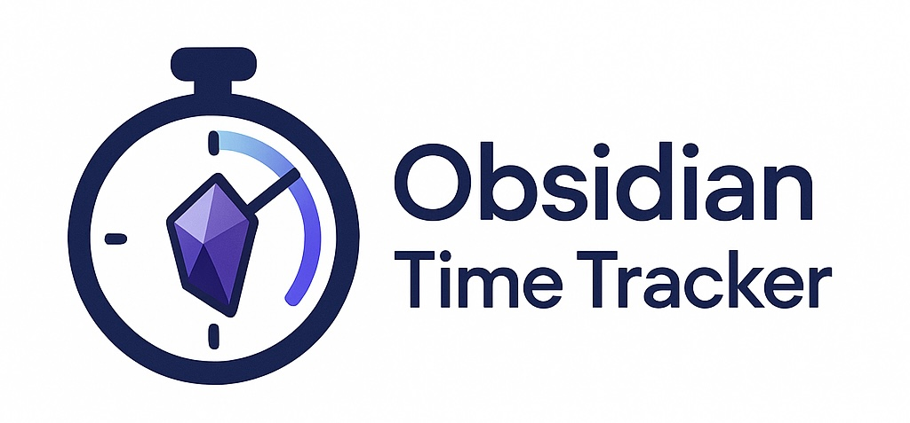
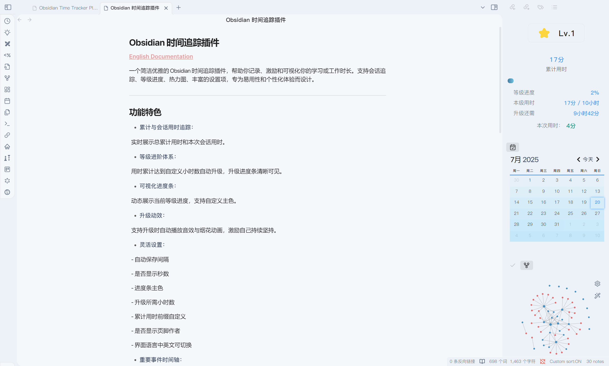
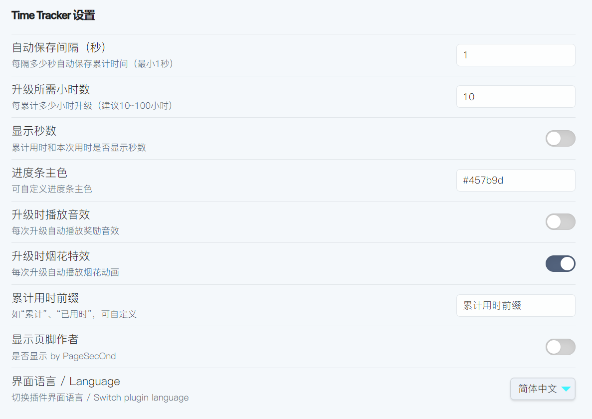

[English](./README.md)

# Simple Time Tracker

<!-- Badges -->

  
  
  
  

  

> 一个简洁优雅的 Obsidian 时间追踪插件，帮助你记录、激励和可视化你的学习或工作时长。支持会话追踪、等级进度、热力图、丰富的设置项，专为易用性和个性化体验而设计。

---

<table>
  <tr>
    <th align="center">主页</th>
    <th align="center">设置项</th>
  </tr>
  <tr>
    <td align="center"></td>
    <td align="center"></td>
  </tr>
</table>

## 功能特色

- **累计与会话用时追踪：**  
  实时展示总累计用时和本次会话用时。

- **等级进阶体系：**  
  用时累计达到自定义小时数自动升级，升级进度条清晰可见。

- **可视化进度条：**  
  动态展示当前等级进度，支持自定义主色。

- **升级动效：**  
  支持升级时自动播放音效与烟花动画，激励自己持续坚持。

- **灵活设置：**  
  - 自动保存间隔
  - 是否显示秒数
  - 进度条主色
  - 升级所需小时数
  - 累计用时前缀自定义
  - 是否显示页脚作者
  - 界面语言中英文可切换

- **重要事件时间轴：**  
  所有升级等重要节点自动记录在 Markdown 时间轴文件中。

- **双语界面：**  
  所有标签与设置均有中英文，随时一键切换。

---

## 安装方法

1. 下载 `main.js`，放入你的 Obsidian 插件目录（vault 下的 plugins 文件夹）。
2. 在 Obsidian 的社区插件设置中启用 Time Tracker。

---

## 使用说明

- 点击侧边栏的时钟图标打开时间追踪面板。
- 插件自动在 Obsidian 打开时开始计时，无需手动启动。
- 在插件设置项中可灵活调整参数，适应你的使用习惯。

---

## 设置项说明

- **自动保存间隔：**  
  每隔多少秒自动保存累计时间（最小1秒）。

- **升级所需小时数：**  
  每累计多少小时自动升级。

- **是否显示秒数：**  
  累计用时和会话用时是否显示秒数。

- **进度条主色：**  
  自定义进度条主色。

- **升级时播放音效：**  
  升级时是否自动播放奖励音效。

- **升级时烟花特效：**  
  升级时是否自动播放烟花动画。

- **累计用时前缀：**  
  如“累计”、“已用时”，可自定义。

- **显示页脚作者：**  
  是否显示页脚作者。

- **界面语言：**  
  中英文界面可随时切换。

---

## 数据存储

- 累计用时等数据保存在 vault 根目录的 `.timestats.json` 文件内。
- 升级等事件自动记录在 `Timeline/TimeLevel.md` 时间轴中。

---

## Todo
- [ ] 支持更多自定义设置项。
- [ ] 增加更多可视化效果。
- [ ] 实现热力图显示
- [ ] 增加更多语言支持。
- [ ] 将样式和语言与主程序分离，便于未来扩展。

---

## 致谢

by PageSecOnd

---

## 开源协议

MIT © [PageSecOnd]
